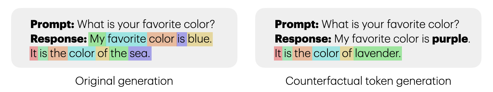

# Counterfactual Token Generation in Large Language Models

This repository contains the code used in the paper ["Counterfactual Token Generation in Large Language Models"](https://arxiv.org/abs/2409.17027) by Ivi Chatzi, Nina Corvelo Benz, Eleni Straitouri, Stratis Tsirtsis, and Manuel Gomez-Rodriguez.

__Contents__:
- [Introduction](#introduction)
- [Dependencies](#dependencies)
- [Repository structure](#repository-structure)
- [Contact & attribution](#contact--attribution)

## Introduction

<div align="center">
  
</div>

*"Sure, I am happy to generate a story for you: Captain Lyra stood at the helm of her trusty ship, the Maelstrom’s Fury, gazing out at the endless sea. \[...\] Lyra’s eyes welled up with tears as she realized the bitter truth - she had sacrificed everything for fleeting riches, and lost the love of her crew, her family, and herself."* Although this story, generated by a large language model, is captivating, one may wonder—how would the story have unfolded if the model had chosen "Captain Maeve" as the protagonist instead? We cannot know. State-of-the-art large language models are stateless—they maintain no internal memory or state. Given a prompt, they generate a sequence of tokens as an output using an autoregressive process. As a consequence, they cannot reason about counterfactual alternatives to tokens they have generated in the past. In this work, our goal is to enhance them with this functionality. To this end, we develop a causal model of token generation that builds upon the Gumbel-Max structural causal model. Our model allows any large language model to perform counterfactual token generation at almost no cost in comparison with vanilla token generation, it is embarrassingly simple to implement, and it does not require any fine-tuning nor prompt engineering. We implement our model on Llama 3 8B-instruct and conduct both qualitative and quantitative analyses of counterfactually generated text. We conclude with a demonstrative application of counterfactual token generation for bias detection, unveiling interesting insights about the model of the world constructed by large language models.


## Dependencies

All the experiments were performed using Python 3.11.2. In order to create a virtual environment and install the project dependencies you can run the following commands:

```bash
python3 -m venv env
source env/bin/activate
pip install -r requirements.txt
```

Our code builds upon Llama 3 8B-instruct, a popular open-weights large language model. For instructions regarding getting access to the model's weights, refer to the [Llama 3 GitHub repository](https://github.com/meta-llama/llama3). In addition to the project dependencies of our own code mentioned above, make sure to install the project dependencies of Llama 3 that are provided in its is own `requirements.txt` file.

## Repository structure

```
├── data
├── figures
├── notebooks
├── outputs
│   ├── bias
│   ├── census*
│   └── story*
├── scripts
│   ├── bias.py
│   ├── census_queries.py
│   ├── cf_query.py
│   ├── stability.py
│   └── story_query.py
└── src
    ├── llama3
    │   ├── llama
    │   │   ├── generation.py
    │   │   └── sampler.py
    │   └── pretrained
    ├── bias.py
    ├── cf_query.py
    ├── single_query.py
    ├── stability.py
    └── utils.py
```

- `data` contains configuration files for our experiments.
- `figures` contains all the figures presented in the paper.
- `notebooks` contains python notebooks to generate all the figures included in the paper.
- `outputs` contains intermediate output files generated by the experiments' scripts. Specifically:
  - `bias` contains the counterfactual census data of Section 4.3 and all possible interventions per attribute. 
  - `census*` directories contain the factual census data of Section 4.3.
  - `story*` directories contain the results of Section 4.1 and Appendix A.
- `scripts` contains a set of scripts used to run all the experiments presented in the paper. 
- `src` contains all the code necessary to reproduce the results in the paper. Specifically:
  - `llama3` contains the code of the LLM, namely, LLama 3 8b-instruct. Therein:
    - `llama/generation.py` uses the LLM to perform factual/counterfactual token generation.
    - `llama/sampler.py` samples from a token distribution using a Gumbel-Max SCM or its top-p and top-k variants.
    - `llama/pretrained/` is a placeholder directory where the weights of the (pre-trained) LLM should be placed.
  - `bias.py` performs counterfactual token generation for all possible interventions for each individual in the LLM generated census data.
  - `cf_query.py` performs counterfactual token generation for a single query.
  - `single_query.py` performs factual token generation for a single query. It creates and saves its results in a subdirectory of `outputs/`, which is then used by `cf_query.py`.
  - `stability.py` performs interventional and counterfactual token generation for the experiments of Section 4.2.
  - `utils.py` contains auxiliary functions for plotting. 


## Contact & attribution

In case you have questions about the code, you identify potential bugs or you would like us to include additional functionalities, feel free to open an issue or contact [Ivi Chatzi](mailto:ichatzi@mpi-sws.org) or [Stratis Tsirtsis](mailto:stsirtsis@mpi-sws.org).

If you use parts of the code in this repository for your own research, please consider citing:

    @article{chatzi2024counterfactual,
      title={Counterfactual Token Generation in Large Language Models}, 
      author={Ivi Chatzi and Nina Corvelo Benz and Eleni Straitouri and Stratis Tsirtsis and Manuel Gomez-Rodriguez},
      year={2024},
      journal={arXiv preprint arXiv:2409.17027}
    }
